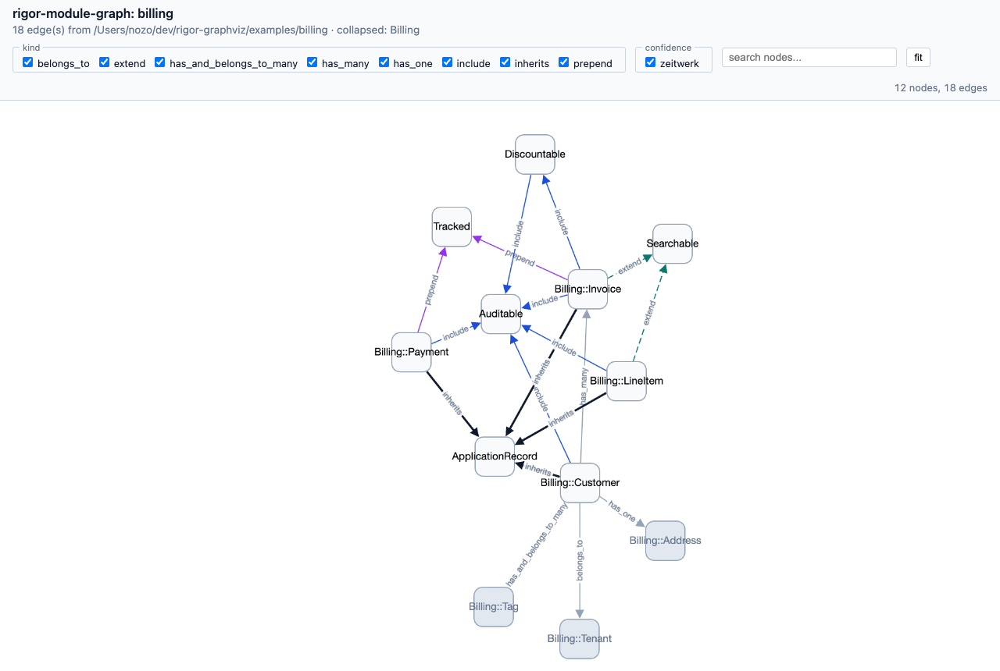

# rigor-module-graph

[](https://rubygems.org/gems/rigor-module-graph)
[](LICENSE.txt)
[](https://github.com/nozomemein/rigor-module-graph/actions/workflows/ci.yml)
[](https://github.com/nozomemein/rigor-module-graph/actions/workflows/docs.yml)

Class/module/constant dependency graph for Ruby projects, built on
[Rigor](https://rigor.typedduck.fail/). The class-level counterpart
to Packwerk/Graphwerk: where those look at package boundaries, this
looks at the Ruby nominal graph — inheritance, `include`/`prepend`/
`extend`, and (later) constant references.

**Two ways to look at the same graph.** Static SVG via
Graphviz for committing into PRs and docs; interactive HTML
via Cytoscape.js for actually exploring a 1000+-node Rails
codebase. Both rendered from the same `edges.jsonl` —
no second analysis pass.

### Graphviz (`--output svg`)


### Cytoscape (`--output html`, the default)



Both screenshots are from `examples/billing/`. Open
`examples/billing/index.html` directly to try the
interactive version — pan, zoom, filter by `kind` /
`confidence`, search by name, click a node to copy
`path:line`.

## Install

Via Bundler:

```ruby
# Gemfile
gem "rigor-module-graph"
```

```sh
bundle install
```

Or system-wide:

```sh
gem install rigor-module-graph
```

Both paths pull in `rigortype` and `rbs ~> 4.0` transitively.
The `rbs ~> 4.0` constraint is the one that matters: rigortype
0.2.x calls `RBS::Environment::ClassEntry#each_decl`, which
only exists in rbs 4.x. The Ruby 4.0 stdlib bundles rbs 3.10
as a default gem, so installing `rigor-module-graph` (which
depends on rbs 4.x) makes RubyGems activate the 4.x gem at
run time and the analyzer stays alive.

For the full pipeline you also want `graphviz` installed so
`view --output svg` and `dot -Tsvg` can render PNG / SVG from
the generated DOT:

```sh
brew install graphviz       # macOS
apt-get install graphviz    # Debian / Ubuntu
```

A working `dot` on `$PATH` is optional — text / Mermaid / HTML
output paths don't need it. See [How it works](docs/how-it-works.md)
for the pipeline overview.

## Getting started

The default subcommand analyses the current directory, writes
a self-contained Mermaid HTML report under
`.rigor/module_graph/`, and opens it in a browser:

```sh
cd path/to/your/project
bundle exec rigor-module-graph         # same as: rigor-module-graph view
```

A `.rigor.yml` must exist in the project root — that's how
`rigor` knows to load this plugin. The minimal version is two
lines:

```yaml
plugins:
  - gem: rigor-module-graph
```

That's enough for `view` to run with all defaults. Everything
else (`paths:`, `autoload_paths:`, …) goes in the
[Configuration](#configuration) section below, and every key
defaults to a sensible Rails-shaped value.

## Usage

### `view` — one-shot HTML / SVG / Mermaid

The default `html` output is an interactive
[Cytoscape.js](https://js.cytoscape.org/)-based viewer:
filter checkboxes for `kind` and `confidence`, live name
search, `fit` button, and node-click → copy `path:line` to
the clipboard. The Cytoscape library is vendored into the gem
at a sha256-pinned version, so the generated HTML opens
offline with no network round-trip.

```sh
# Don't open the browser (just write the HTML)
rigor-module-graph view --no-open

# Pick a different output format. `html` is the interactive
# viewer; `mermaid-html` is the legacy static-Mermaid embed
# (loads Mermaid from a CDN, kept for back-compat). Everything
# else streams to stdout unless `-o` is given.
rigor-module-graph view --no-open --output mermaid-html  > graph.html
rigor-module-graph view --no-open --output mermaid       > graph.mmd
rigor-module-graph view --no-open --output dot           > graph.dot
rigor-module-graph view --no-open --output svg           > graph.svg
rigor-module-graph view --no-open --output class-diagram > class.mmd
rigor-module-graph view --output svg -o graph.svg

# Click on a node opens the file in VSCode rather than copying
# path:line to the clipboard. `--path-mode none` strips the
# path metadata entirely — useful when sharing the HTML
# artefact outside the project.
rigor-module-graph view --open-with vscode
rigor-module-graph view --path-mode none      # share-safe
rigor-module-graph view --path-mode absolute  # cwd-resolved

# Focus on what's around one or a few constants
rigor-module-graph view --from Article --depth 5
rigor-module-graph view --from Article --depth 5 --direction out
rigor-module-graph view --from Billing::Invoice,Billing::Payment --depth 2

# Pick your own collapse list (default: auto-detect top-level
# namespaces with ≥ 3 members; applies to mermaid / dot / svg
# outputs — the interactive html viewer ignores it).
rigor-module-graph view --collapse Billing,Auth
rigor-module-graph view --no-collapse

# Same kind / confidence filters as the lower-level commands
rigor-module-graph view --kind inherits,include
rigor-module-graph view --confidence syntax,zeitwerk

# Cluster by Packwerk packages (auto-detects package.yml under cwd)
rigor-module-graph view --package
rigor-module-graph view --package-root /path/to/repo
```

`--direction` controls how the `--from` walk follows edges:

| direction | meaning                                |
|-----------|----------------------------------------|
| `out`     | only "what does Article depend on"     |
| `in`      | only "what depends on Article"         |
| `both`    | both (default)                         |

`--edge-scope` controls which edges survive once the BFS finishes:

| edge-scope | meaning                                                    |
|------------|------------------------------------------------------------|
| `cluster`  | keep every edge whose endpoints both fall in the reachable set (default — good for "show me the Article neighbourhood as a cluster") |
| `walk`     | keep only the edges the BFS actually traversed (good for "show me what depends on Article and nothing else"; drops sibling edges like `Foo inherits ApplicationRecord` that just happen to share a base class with reachable nodes) |

A 1-hop `--from Article --direction out --edge-scope walk`
returns exactly the edges whose `from` is `Article`, never the
sibling `inherits ApplicationRecord` of a reached node.

### Lower-level pipeline

The pipeline `view` runs is also exposed as discrete
subcommands when you want JSONL on disk or a pipeable text
output:

```sh
# Run `rigor check` and write edges JSONL
# (default: .rigor/module_graph/edges.jsonl)
bundle exec rigor-module-graph collect

# Render the graph
bundle exec rigor-module-graph dot     .rigor/module_graph/edges.jsonl > graph.dot
bundle exec rigor-module-graph mermaid .rigor/module_graph/edges.jsonl > graph.mmd
dot -Tsvg graph.dot -o graph.svg

# Detect cycles (exit 1 if any are found)
bundle exec rigor-module-graph cycles  .rigor/module_graph/edges.jsonl

# Per-namespace fan-in / fan-out report
bundle exec rigor-module-graph stats   .rigor/module_graph/edges.jsonl
bundle exec rigor-module-graph stats --format json --limit 10 edges.jsonl

# UML class diagram (Mermaid classDiagram). Reads edges + the
# sibling nodes.jsonl that `collect` writes.
bundle exec rigor-module-graph class-diagram .rigor/module_graph/edges.jsonl > class.mmd
bundle exec rigor-module-graph class-diagram --no-private --no-attributes edges.jsonl
```

`collect` shells out to `rigor check --format json --no-cache`
and filters diagnostics on
`source_family == "plugin.module-graph"` + `rule == "edge"`,
so re-running is deterministic and there's no on-disk
side-effect from the plugin itself.

`dot` / `mermaid` / `cycles` accept a file argument or read stdin.

### Filters and collapse

All reader subcommands accept the same filter flags. They prune
the edge set before rendering / detecting; the JSONL on disk is
untouched.

```sh
# Drop noisy const_ref / unresolved edges
bundle exec rigor-module-graph dot --kind inherits,include,prepend,extend edges.jsonl

# Only the edges we're sure about
bundle exec rigor-module-graph dot --confidence syntax,zeitwerk,rigor_type edges.jsonl

# Fold every Billing::* node into one cluster
# (Dot: subgraph_cluster_; Mermaid: subgraph)
bundle exec rigor-module-graph dot     --collapse Billing,Auth edges.jsonl
bundle exec rigor-module-graph mermaid --collapse Billing edges.jsonl

# Restrict the graph to the neighbourhood of one or a few
# constants (works on dot / mermaid / cycles too)
bundle exec rigor-module-graph dot     --from Article --depth 5 edges.jsonl
bundle exec rigor-module-graph mermaid --from Article --depth 5 --direction out edges.jsonl

# Cluster by Packwerk packages instead of by namespace
bundle exec rigor-module-graph dot     --package edges.jsonl  # cwd
bundle exec rigor-module-graph mermaid --package-root /path/to/repo edges.jsonl

# Cycles that stay within structural edges only
bundle exec rigor-module-graph cycles --kind inherits,include edges.jsonl
```

## Configuration

`.rigor.yml` lives in the project root and is **required** —
`rigor` reads it to discover this plugin. `rigor init` scaffolds
a `.rigor.dist.yml` you can rename, or write it by hand. The
two-line minimum from [Getting started](#getting-started) is
enough; the full form below is for tuning.

```yaml
target_ruby: '4.0'
paths:
  - app
  - lib
plugins:
  - gem: rigor-module-graph
    config:
      rails_zeitwerk: true
      autoload_paths:
        - app/models
        - app/controllers
        - app/services
        - app/jobs
        - lib
      concern_dirs:
        - app/models/concerns
        - app/controllers/concerns
      include_constant_refs: false
```

Every key shown is the default. Two switches worth knowing:

- `include_constant_refs: true` — emit `const_ref` edges from
  bare constant references inside method bodies. Off by default
  because the volume of edges grows fast on a typical Rails app
  and the noise can drown the structural picture.
- `rails_zeitwerk: false` — keep every edge at
  `confidence: "syntax"` and skip the path-based owner
  inference. Useful when the project doesn't follow Zeitwerk's
  autoload convention.

## Compatibility

- Ruby `>= 4.0.0, < 4.1`
- rigortype `~> 0.2.1`
- rbs `~> 4.0`

## Documentation

The public RDoc API is generated locally via `rake rdoc`,
served on `http://localhost:8808` via `rake rdoc:server`, and
published to GitHub Pages on every push to `main`.

- [API reference (GitHub Pages)](https://nozomemein.github.io/rigor-module-graph/) —
  built from `main`, mirrors the current source.
- [API reference (RubyGems)](https://rubydoc.info/gems/rigor-module-graph) —
  the last released gem on rubydoc.info.
- [How it works](docs/how-it-works.md) — the static-analysis
  pipeline (Prism → node rules → confidence ladder → JSONL →
  renderers), and why this is a nominal dependency graph and
  not a call graph.
- [Development guide](docs/development.md) — local setup, git
  hooks, CI / Release workflows, test suite layout.
- [Design plan](docs/plan.md) — the decisions still
  load-bearing for the code (edge model, confidence ladder,
  output channel, owner resolution, architecture map).
- [Known limitations](docs/limitation.md) — rough edges shipped
  with the current release (visibility tracker gaps, the
  bundled inflector, Mermaid 10.x quirks).
- [Changelog](CHANGELOG.md) — per-version changes, formatted
  per [Keep a Changelog](https://keepachangelog.com/en/1.1.0/)
  with [Semantic Versioning](https://semver.org/spec/v2.0.0.html).
  The release workflow gates on a `## [VERSION]` entry being
  present before pushing to RubyGems.
