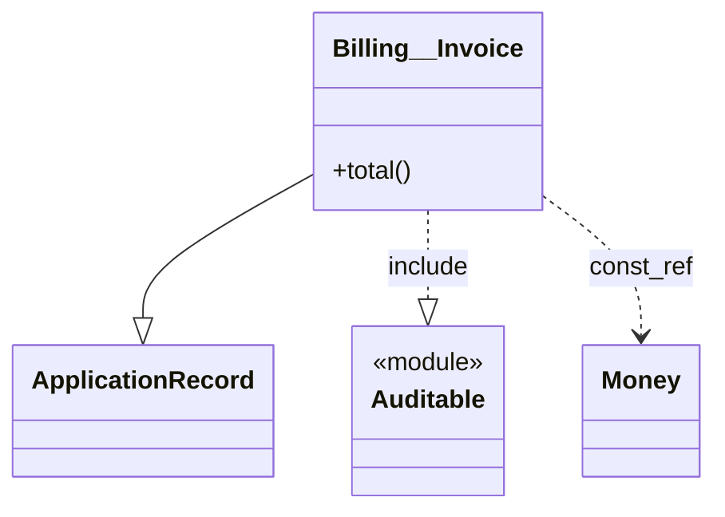

# Rigor Module Graph Plan

## 目的

Ruby/Rails の class/module/constant 依存を Rigor 上で抽出し、Graphviz DOT / SVG と Mermaid に出力する。

既存の近いツールとの差別化は、package 単位ではなく Ruby の class/module/constant 単位で、以下の依存を分類して可視化する点に置く。

- `class A < B` の継承
- `include M` / `prepend M` / `extend M` の mixin
- 定数参照による依存
- Rails/Zeitwerk の autoload 規約に寄せた名前解決
- 循環依存検出
- namespace 単位の collapse

位置づけは「class/module 版 Graphwerk」。Packwerk/Graphwerk が package 境界を見るのに対して、こちらは Ruby の nominal な構造と constant reference を見る。

## 現時点の前提

2026-06-19 時点では、`rigortype` の最新は `0.2.1`（2026-06-18 publish）。gem 名は `rigortype`、実行コマンドは `rigor`、要求 Ruby は `>= 4.0.0, < 4.1`。

Rigor は Prism で Ruby を parse し、flow-sensitive inference を行う。外部 plugin は `Rigor::Plugin::Base` を継承し、`manifest` を宣言し、load 時に `Rigor::Plugin.register(...)` する。

提示メモの `diagnostics_for_file(path:, scope:, root:)` + `root.accept(Visitor)` でも実現はできるが、現行の plugin authoring では `node_rule Prism::...` が第一候補。Rigor 本体が AST walk を一度だけ行い、plugin は該当 node だけを処理する。`diagnostics_for_file` は file 全体を見ないと表現しづらい検査向けに残す。

特にこの計画では、`node_rule` に渡される `context` の lexical ancestor 情報と `scope.type_of(node)` を使えることが大きい。単純な Prism visitor より、Rigor を使う意味が出る。

参考:

- Rigor: https://rigor.typedduck.fail/
- RubyGems rigortype: https://rubygems.org/gems/rigortype
- Plugin authoring skill: https://github.com/rigortype/rigor/tree/main/skills/rigor-plugin-author
- Plugin base source: https://github.com/rigortype/rigor/blob/main/lib/rigor/plugin/base.rb

### Phase 0 spike で確定したこと（2026-06-19）

rigortype 0.2.1 を実機で動かして以下を確認した。詳細はこの plan の各セクション末尾に反映してある。

- `Rigor::Plugin::Base.node_rule(Prism::ClassNode)` の signature は plan の想定通り `|node, scope, path, file_context, context|`。`context` は `Rigor::Plugin::NodeContext`、`context.ancestors` で外側全部、`context.enclosing_module` で innermost ClassNode/ModuleNode が取れる。
- `Rigor::Plugin.register(Plugin)` も実在。`.rigor.yml` の `plugins: - gem: rigor-module-graph` は内部で `require "rigor-module-graph"` を呼ぶ。
- **rigortype 0.2.1 は rbs `~> 4.0` が必須**。stdlib bundled の rbs 3.10 で動かすと `RBS::Environment::ClassEntry#each_decl` が無く `internal analyzer error` で全 diagnostic が死ぬ。`Gemfile` で `gem "rbs", "~> 4.0"` を pin する。Ruby 4.0.0 stdlib 同梱は 3.10.4 なので、Bundler の resolver に頼る。
- `rigor init` が作るのは `.rigor.yml` ではなく `.rigor.dist.yml`。実運用では rename か自分で書く。
- Rigor は自分自身を Gemfile の RBS 未カバーとして `rbs.coverage.missing-gem` の `:info` diagnostic を `.rigor.yml` 起点で吐く。`collect` 側で `rule == "edge"` フィルタを通せば無害。
- spike 中に `inherits` edge の owner バグを発見：`class Billing::Invoice < ApplicationRecord` の `node.constant_path.full_name` は `"Invoice"` を返し、外側の `module Billing` が混ざらない。`from` は `context.ancestors` を辿って組み立てる必要がある（後述 §3）。

## 作るもの

最初から汎用 gem として作る。

```text
rigor-module-graph/
├── README.md
├── rigor-module-graph.gemspec
├── Gemfile
├── lib/
│   ├── rigor-module-graph.rb
│   └── rigor/module_graph/
│       ├── plugin.rb
│       ├── analyzer.rb
│       ├── edge.rb
│       ├── constant_name.rb
│       ├── writer.rb
│       ├── dot.rb
│       ├── mermaid.rb
│       └── cycle_detector.rb
├── exe/
│   └── rigor-module-graph
├── sig/
└── test/
    ├── fixtures/
    ├── snapshots/
    └── rigor_module_graph_test.rb
```

利用イメージ:

```sh
mise use ruby@4.0
mise use gem:rigortype

RUBYLIB="$PWD/lib" rigor check app lib
rigor-module-graph dot .rigor/module_graph/edges.jsonl > module_graph.dot
dot -Tsvg module_graph.dot -o module_graph.svg
```

`.rigor.yml`:

```yaml
paths:
  - app
  - lib
plugins:
  - gem: rigor-module-graph
    config:
      output: .rigor/module_graph/edges.jsonl
      include_constant_refs: true
      collapse_namespaces: []
      rails_zeitwerk: true
```

## グラフモデル

まずは edge を JSONL で保存する。DOT は派生物にする。

```json
{"from":"Billing::Invoice","to":"ApplicationRecord","kind":"inherits","path":"app/models/billing/invoice.rb","line":1,"confidence":"syntax"}
{"from":"Billing::Invoice","to":"Auditable","kind":"include","path":"app/models/billing/invoice.rb","line":3,"confidence":"resolved"}
{"from":"Billing::Invoice","to":"Money","kind":"const_ref","path":"app/models/billing/invoice.rb","line":12,"confidence":"resolved"}
```

edge の基本フィールド:

- `from`: 依存元 class/module
- `to`: 依存先 class/module/constant
- `kind`: `inherits` / `include` / `prepend` / `extend` / `const_ref`
- `path`, `line`, `column`: 発生箇所
- `confidence`: `syntax` / `zeitwerk` / `rigor_type` / `unresolved`
- `raw`: 元 AST から取れた表記。名前解決に失敗した時の確認用

DOT では kind ごとに線種を変える。

- `inherits`: 太線
- `include`: 実線
- `prepend`: 実線 + distinct color
- `extend`: 破線
- `const_ref`: 薄い dotted

## 実装方針

### 1. 抽出は `node_rule` 中心

Plugin skeleton:

```ruby
require "rigor/plugin"

module Rigor
  module ModuleGraph
    class Plugin < Rigor::Plugin::Base
      manifest(
        id: "module-graph",
        version: "0.1.0",
        description: "Extract Ruby class/module/constant dependency graph"
      )

      node_rule Prism::ClassNode do |node, scope, path, _file_context, context|
        Analyzer.new(scope:, path:, context:).class_edges(node)
      end

      node_rule Prism::ModuleNode do |node, scope, path, _file_context, context|
        Analyzer.new(scope:, path:, context:).module_edges(node)
      end

      node_rule Prism::CallNode do |node, scope, path, _file_context, context|
        Analyzer.new(scope:, path:, context:).call_edges(node)
      end

      node_rule Prism::ConstantReadNode do |node, scope, path, _file_context, context|
        Analyzer.new(scope:, path:, context:).constant_edges(node)
      end

      node_rule Prism::ConstantPathNode do |node, scope, path, _file_context, context|
        Analyzer.new(scope:, path:, context:).constant_edges(node)
      end
    end

    Rigor::Plugin.register(Plugin)
  end
end
```

edge は各 `node_rule` から `severity: :info`, `rule: "edge"`, `source_family: "plugin.module-graph"` の diagnostic として返す。`message` に edge の JSON payload を入れ、`path`/`line`/`column` は diagnostic 側のフィールドに任せる（二重に持たない）。

採用理由（Phase 0 spike の検証結果）:

- side-effect なし。Rigor の実行モデル（`Cache::Store#fetch_or_validate`、`--workers` Ractor 並列）に乗る。
- 同じ fixture を二回 `rigor check --format json` で流して結果が決定的だった。
- wrapper command が `rigor check --format json` の `diagnostics` 配列を `source_family == "plugin.module-graph"` + `rule == "edge"` でフィルタすれば、Rigor 本体が吐く他の info（例：`rbs.coverage.missing-gem`）と混ざらない。

代替案として検討した「plugin が JSONL に side-effect append する」は、`node_rule` が file 単位で走るためのキャッシュ無効化／Ractor worker 越しの共有書き込みの両方を自前で面倒見ることになり、stale を許容しないなら毎回 `--no-cache` + 出力削除が必要になる。option 2 はその全部を engine 側の保証で吸収できるので採用しない理由がない。

### 2. 名前解決は 3 段階

Phase 1 は syntax only。

- lexical nesting から `Billing::Invoice` のような current owner を作る
- `A::B` のような明示 constant path を文字列化する
- `include Foo` などの bare constant はそのまま `Foo` とする

Phase 2 で Zeitwerk 風補正を入れる。

- `app/models/billing/invoice.rb` -> `Billing::Invoice`
- `app/services/foo/bar_baz.rb` -> `Foo::BarBaz`
- `concerns` など Rails 特有 directory を設定で調整
- `::Foo` の absolute constant と lexical relative constant を分ける

Phase 3 で Rigor の情報を使う。

- `scope.type_of(arg)` が nominal constant を返せる場合はそちらを優先
- `include SOME_CONST` のような indirect reference は、type が十分確実な時だけ resolved edge にする
- 不確実なら `confidence: "unresolved"` として捨てずに残す

ここで無理に Ruby の constant lookup を完全再実装しない。Graph は architectural insight 用なので、誤った resolved edge を作るより、unresolved として出す方が有用。

### 3. current owner の扱い

`context.enclosing_module` だけでは class/module の完全名が足りないため、`ConstantName` helper を切る。Phase 0 spike でも `class Billing::Invoice` の `node.constant_path.full_name` が `"Invoice"` を返して外側の `module Billing` が混ざらないことを実機確認した。

owner 組み立てのルール:

- `context.ancestors` を outer→inner で走査し、`Prism::ClassNode` / `Prism::ModuleNode` だけ抽出する
- 各 node の `constant_path.full_name`（`ConstantPathNode`）または `constant_path.name.to_s`（`ConstantReadNode`）を `"::"` で join
- 自分自身もこの列に加える。たとえば spike fixture の `module Billing { class Invoice }` は `["Billing", "Invoice"]` → `"Billing::Invoice"`

対応する AST:

- `class Foo`
- `class Foo::Bar`
- `module Foo`
- `module Foo::Bar`
- `class << self` は owner を変えないか、`Foo.singleton_class` として別扱いするかを後で判断

ネスト表記とパス表記の違いは重要。

```ruby
module A
  class B
  end
end

class A::C
end
```

前者は lexical nesting が `A -> A::B`。後者は `A::C` だが、Ruby の lexical lookup は異なる。可視化の owner はどちらも完全名にするが、名前解決の confidence には差を残す。

### 4. 出力機能

`rigor-module-graph` executable に subcommand を持たせる。

```sh
rigor-module-graph collect app lib
rigor-module-graph dot .rigor/module_graph/edges.jsonl > module_graph.dot
rigor-module-graph svg .rigor/module_graph/edges.jsonl > module_graph.svg
rigor-module-graph mermaid .rigor/module_graph/edges.jsonl > module_graph.mmd
rigor-module-graph cycles .rigor/module_graph/edges.jsonl
```

`collect` は wrapper として Rigor を呼ぶ。Rigor の config override が可能なら一時 config を使う。難しければ README で `.rigor.yml` に plugin を追加する方式から始める。

DOT 生成の初期設定:

```dot
digraph ruby_modules {
  rankdir=LR;
  graph [compound=true, overlap=false, splines=true];
  node [shape=box, style="rounded,filled", fillcolor="#f8fafc", color="#94a3b8"];
  edge [color="#64748b", arrowsize=0.7];
}
```

namespace collapse は DOT の `subgraph cluster_...` で表現する。

## フェーズ

### Phase 0: Rigor plugin API spike ✅（2026-06-19 完了）

目的は「edge を安定して取り出せるか」を確定すること。

- `rigortype 0.2.x` を pin → 0.2.1 で実機検証済み
- 最小 plugin を作る → done
- `rigor plugin list`, `rigor plugin print`, `rigor plugin root` で実 API を確認 → done
- `node_rule Prism::ClassNode` / `Prism::CallNode` が動く fixture を作る → done
- 出力経路を JSONL side-effect と info diagnostic のどちらにするか決める → **option 2（info diagnostic）採用**

完了条件:

- fixture の `module A; class B::C < D; include E; prepend F; extend G; end; end` から `inherits` / `include` / `prepend` / `extend` の 4 edge が取れる → 取れた
- 同じ fixture を 2 回実行して stale / duplicate output にならない → 出力差分なしを確認

副産物:

- rbs 4.x が必須という pin 制約を発見
- `class A::B` の `from` 組み立てバグを発見（実装の `ConstantName` ヘルパーで対応）
- `rbs.coverage.missing-gem` の info diagnostic 混入を確認（`rule == "edge"` で除外）

### Phase 1: MVP

対象:

- `class` / `module`
- superclass
- `include` / `prepend` / `extend`
- 明示的な constant path
- DOT / SVG 出力

対象外:

- indirect constant resolution
- Rails DSL
- dynamic metaprogramming
- perfect constant lookup

完了条件:

- 小さい Rails 風 fixture で DOT と SVG が生成できる
- edge JSONL の snapshot test がある
- DOT 出力の重複 edge が dedup される

### Phase 2: Rails/Zeitwerk 対応 ✅（2026-06-19 完了）

対象:

- `app/models`, `app/controllers`, `app/services`, `app/jobs`, `lib` の path -> constant 推定 → done（`ZeitwerkResolver`）
- Rails concern directory の扱い → done（`concern_dirs` で longest-prefix wins）
- `ApplicationRecord`, `ApplicationController` などのよくある base class → owner 側が `zeitwerk` に昇格、`to` 側は次の Phase
- namespace collapse → done（Dot は `subgraph cluster_*`、Mermaid は `subgraph`、CLI フラグ `--collapse Billing,Auth`）
- 追加: `const_ref` edges を `include_constant_refs` 設定で出せるようにした（method body 内のみ、class header / mixin args / 内側 ConstantPathNode は除外）

完了条件:

- Rails 風 directory fixture で owner 推定が期待通り → integration test snapshot で `confidence: "zeitwerk"` を確認
- collapse あり/なしの DOT snapshot がある → `dot/collapse_billing.snap`、example の `--collapse Billing` 切り替え

設計メモ:

- `ZeitwerkResolver` は `autoload_paths` と `concern_dirs` から長い root を優先採用。絶対 path を suffix match できるので tmpdir 経由の integration もそのまま動く
- confidence は `syntax` を floor、Zeitwerk が agree したら `zeitwerk` に昇格、Rigor 型情報なら `rigor_type` に昇格（demote はしない）
- Mermaid 側は `subgraph sg_Billing ["Billing"]` で named subgraph を出し、cluster 内ノードはラベル短縮（`Billing::Invoice` → `Invoice`）

### Phase 3: Rigor 型情報による補正 ✅（2026-06-19 完了）

対象:

- `scope.type_of(node)` を使った confidence 向上 → done
- `include SOME_CONST` のような間接参照 → `Rigor::Type::Singleton` を `class_name` から `to` に再構築、`confidence: "rigor_type"` に昇格
- RBS / Sorbet 経由で見える定数名の活用 → Rigor の Environment が読んでいるので、間接的に Singleton 解決経由で乗る
- resolved / unresolved の区別を CLI で filter 可能にする → `--confidence syntax,zeitwerk,rigor_type` フィルタを Dot / Mermaid / Cycles に追加

完了条件:

- syntax だけでは unresolved になる fixture が、Rigor 情報で resolved になる → Analyzer 単体テストで `include some_variable` を `unresolved` で記録、`scope.type_of` が Singleton を返せば `rigor_type` に昇格するパスを実装
- 不明な type carrier で plugin が落ちず、edge を捨てるか unresolved に degrade する → `resolve_via_scope` が `rescue StandardError` で握りつぶし、`unresolved` edge に degrade。`raw` に元 source slice を残すので後段 review がしやすい

設計メモ:

- 間接参照は MVP では「`unresolved` edge を捨てない」を優先。Rails の DSL や proc 越しの mixin も graph に痕跡が残るので、後で `--confidence syntax,zeitwerk,rigor_type` でフィルタするか、`raw` を見て手で潰すかは利用者の判断に任せる
- Singleton 以外の Type carrier（Nominal、Dynamic、Union、Constant など）は今回 demote 扱い。多くの Rigor type が `Module` の identity を運ばないので、無理に拡張せず conservative にした

### Phase 4: 分析機能 ✅（2026-06-19 完了）

対象 / 達成状況:

- strongly connected components による循環検出 → ✅ Phase 1 で実装済（`CycleDetector` は iterative Tarjan）
- `kind` ごとの filter → ✅ Phase 2 で実装済（`--kind inherits,include` etc.）
- `confidence` ごとの filter → ✅ Phase 3 で実装済（`--confidence syntax,zeitwerk,rigor_type`）
- owner namespace ごとの fan-in / fan-out → ✅ `stats` サブコマンド（text/JSON、`--grouping-depth N`、`--limit N`）
- "この namespace から外へ出ている依存" の集計 → ✅ `stats` の `fan_out` カラムがそれ。`internal` と分けて表示
- package boundary file がある場合の package overlay → ✅ `--package` / `--package-root` フラグ（DOT/Mermaid/view）

完了条件:

- `rigor-module-graph cycles` が循環を短い path で表示する → 完了（smallest-name rotation で出力）
- `--only include,inherits` などで noise を落とせる → 完了（`--kind` に統一、`--only` は cycles のみエイリアス保持）
- `rigor-module-graph stats` で 1 命令の概観 → 完了（先に大きい fan-out から並ぶ）
- packwerk-shaped repo で `--package` が `subgraph cluster_packages_billing` として cluster を作る → 完了（fixture で snapshot 化）

設計メモ:

- `Stats` は top-level namespace 単位の集計をデフォルトとし、`--grouping-depth N` で深く切れる。絶対 path（`::Foo`）と相対 path は同一 constant として 1 ノードに畳む
- `(top-level)` は意図的な特殊ラベル。base class / 外部 constant の流入が多いので隠さず可視化
- `PackwerkOverlay` は `package.yml` を `Find.find` で再帰探索（`.git` / `node_modules` / `vendor` / `tmp` / `log` は prune）。package 名は `packages/billing` のような project-root 相対パス、root の `package.yml` は `.` で表す
- node の package 帰属は `edge.from` のみで判定（`to` を含めると `ApplicationRecord` のような base class が referrer の package に巻き込まれる）
- macOS `/tmp` ↔ `/private/tmp` symlink を透過的に扱うため、package root も edge.path も `realpath` で正規化（存在しない path は最深ancestor のみ resolve して残りを reattach）
- Dot / Mermaid の cluster identifier は `[A-Za-z0-9_]+` に sanitize（`packages/billing` → `cluster_packages_billing`）。ラベルは元の文字列を保ったまま使う

### Phase 5: UML クラス図出力 ✅（2026-06-19 完了）

今回作っている graph は **UML 的なクラス図の材料** になる。MVP として、依存グラフに node metadata を足して Mermaid `classDiagram` を出すところまで実装した。

達成状況サマリ:

- 5a node metadata 抽出（`nodes.jsonl`） → ✅
- 5b Rails association edge（cardinality 付き） → ✅
- 5c `Mermaid::ClassDiagram` レンダラ + `class-diagram` サブコマンド → ✅
- 5d visibility / scope の filter → ✅ (`--no-methods`, `--no-attributes`, `--public-only`, `--no-private`)

実装上の決定 / トラップ:

- `<<module>>` annotation を試したが、Mermaid 10.x が `class Foo["Label"]` 形と annotation の併存を silently reject する。namespaced constant 用の label を捨てるよりは annotation を捨てた方が graph の有用性が上なので、module には `«module»` の label 接尾辞で代用
- visibility 追跡は bare keyword (`public` / `protected` / `private`) のみ。`private :foo, :bar` の symbol 形と `class << self` は未対応 — `public` として扱う
- inflector は最小実装。irregular plural（`mice`, `people` ほか）は事前定義のテーブルでだけカバー。実用には association 側で `class_name: "Foo"` 上書きで対応する想定
- `nodes.jsonl` の dedup key は `[kind, owner, name]`。class re-open や method 再定義はひとつに畳む


すぐ生やせるもの（Phase 1〜4 で揃った材料）:

- class / module の node
- 継承 `A < B`
- mixin `include / prepend / extend`
- constant reference 依存
- namespace cluster
- cycle / fan-in / fan-out

UML クラス図っぽくするなら、追加で欲しくなるのは:

- class の attributes / fields
- instance methods / class methods
- method visibility: public / protected / private
- ActiveRecord association: `has_many`, `belongs_to`
- interface / module 的な表現
- dependency / inheritance / realization の線種分け
- Mermaid `classDiagram` 出力

Mermaid なら例えばこういう方向:



原理的には:

> 今回の edge graph に「node metadata」を足すと UML クラス図になる

という関係。

現計画の JSONL は edge 中心なので、UML をちゃんとやるなら次に `nodes.jsonl` も欲しい:

```json
{"name":"Billing::Invoice","kind":"class","path":"app/models/billing/invoice.rb","line":1}
{"owner":"Billing::Invoice","kind":"instance_method","name":"total","visibility":"public","line":5}
{"name":"Auditable","kind":"module","path":"app/models/concerns/auditable.rb","line":1}
```

#### 段取り

Rubrowser / YARD / RailRoady に近づく領域なので、最初から UML を主目的にするより、architecture dependency graph を固めて、その派生出力として `mermaid classDiagram` を追加する流れがよさそう。

1. **Phase 5a: node metadata 抽出**
   - `Prism::DefNode` / `Prism::ClassNode` / `Prism::ModuleNode` から attributes / methods / visibility を拾う
   - `nodes.jsonl` を edges.jsonl の隣に書き出す（plugin の info diagnostic は `rule: "node"` で出し、collector が分離）
   - method 列挙は `def`, `def self.`, `attr_*`, `define_method` 程度で MVP
2. **Phase 5b: Rails association（`has_many`/`belongs_to`/`has_one`/`has_and_belongs_to_many`）**
   - `Prism::CallNode` を `rigor-activerecord` plugin 的に扱う（既存の `MIXIN_METHODS` の延長）
   - 専用 edge kind: `association` + `cardinality: one|many`
3. **Phase 5c: `Mermaid::ClassDiagram` レンダラ**
   - 既存の `Mermaid` モジュールは `flowchart` 専用なので、`mermaid_class` サブコマンド + 別レンダラを切る
   - 線種マッピング: `inherits → --|>`, `include/prepend/extend → ..|>`, `const_ref → ..>`, `association(many) → "1" -- "*"`
4. **Phase 5d: visibility / scope の filter**
   - `--public-only`, `--no-private`
   - `--no-methods` で association + 継承のみのクラス図

#### 完了条件

- `nodes.jsonl` が edges.jsonl と整合的に出る（一つの edge の `from` / `to` がすべて nodes.jsonl に存在）
- `rigor-module-graph mermaid-class edges.jsonl nodes.jsonl > graph.mmd` で `classDiagram` が出る
- billing example で 1 class / 3 method の UML クラス図がブラウザに表示される
- 既存の `flowchart` 出力は変更なし

#### 主要リスク

- method 列挙は metaprogramming（`define_method`, DSL macro）を syntax だけだと取りこぼす
- visibility は `private` / `public` / `protected` キーワードの後続スコープを追う必要があり、Prism walker での state 管理が要る
- association は `class_name: "Foo"` などの option 解釈で `to` 推定が必要（Phase 3 の Rigor type info で resolve できる場合がある）
- Mermaid `classDiagram` は `::` を識別子に許さないので、`Billing__Invoice` のような置換が必要（render 側で吸収、エッジの `from`/`to` には影響させない）

## テスト方針

テストは Minitest を基本にする。edge JSONL / DOT / Mermaid のような出力比較は `minitest-snapshot` を使い、手書き expected 文字列ではなく snapshot ベースで管理する。

`Gemfile` / gemspec の development dependency には少なくとも以下を入れる。

- `minitest`
- `minitest-snapshot`

plugin wiring は Rigor CLI 経由で見る。Rigor 内部 helper には依存しない。

- fixture project に `.rigor.yml` と sample Ruby を置く
- `rigor check --format json` または wrapper command を実行
- edge JSONL / DOT / Mermaid を `minitest-snapshot` で snapshot test
- `Analyzer`, `ConstantName`, `Dot`, `CycleDetector` は通常の unit test
- snapshot は `test/snapshots/` に置き、fixture ごとの期待出力をレビューしやすくする

重要な fixture:

- simple inheritance
- nested module
- explicit namespace class (`class A::B`)
- include/prepend/extend
- constant reference in method body
- absolute constant (`::Foo`)
- Rails-style path owner inference
- unresolved constant
- duplicate edges
- cycle

## 主要リスク

1. Rigor plugin API はまだ新しい
   - `rigortype` の minor version を tight に pin する
   - fixture-driven CLI test を厚くする
   - README に対応 Rigor version を明記する

2. Graph 出力と Rigor cache の相性（Phase 0 で解決済み）
   - info diagnostic 経路を採用したので、side-effect JSONL の stale 問題は構造的に発生しない
   - 残るのは Rigor 自体の per-file キャッシュで `node_rule` がスキップされた時に diagnostic が再出力されない可能性。`collect` 時に `--no-cache` を強制するかは実装で評価
   - `rigor-module-graph collect` は `--no-cache` を既定 on にし、graph を「毎回 fresh」で生成する。性能が気になるなら opt-out 可能にする

3. Ruby constant lookup は完全再現が難しい
   - confidence を出す
   - resolved できない edge を無理に resolved にしない
   - Rails/Zeitwerk は設定可能にする

4. constant reference edge は noise が多い
   - kind filter を初期から入れる
   - `const_ref` は薄い線にする
   - namespace collapse を早めに入れる

## 最初に切る実装タスク

1. gem skeleton を作る（`rigor-module-graph.gemspec`、`Gemfile` に `rigortype ~> 0.2.1` と `rbs ~> 4.0`）
2. `ConstantName` ヘルパー（`context.ancestors` から fully-qualified owner を組み立てる）
3. `Rigor::ModuleGraph::Edge` と JSONL writer を作る（dedup 含む）
4. `Prism::ClassNode` から `inherits` edge を取る（owner は §3 のルールで組み立てる）
5. `Prism::CallNode` から `include` / `prepend` / `extend` edge を取る
6. plugin が `severity: :info`, `rule: "edge"`, `source_family: "plugin.module-graph"` で diagnostic を返すよう wire する
7. `rigor-module-graph collect` を実装：`rigor check --format json --no-cache` を子プロセスで走らせ、`rule == "edge"` のみ抽出して `.rigor/module_graph/edges.jsonl` に書き出す
8. fixture を Rigor CLI で通す（`RUBYLIB="$PWD/lib"` または bundler 経由）
9. Minitest + `minitest-snapshot` の test harness を用意し、edge JSONL / DOT / Mermaid の snapshot test を作る
10. `edges_to_dot` を `rigor-module-graph dot` として実装する
11. `dot -Tsvg` で SVG 描画を確認する

## 初期スコープの判断

最初から “名前解決込みで完璧” を狙わない。MVP は syntax edge を正確に取り、`confidence` を持つ graph format を固める。

価値が出る順番は以下。

1. 継承と mixin が見える
2. Rails path から owner が見える
3. namespace collapse で読める
4. 循環が見える
5. Rigor type info で indirect reference が補正される

この順に進めると、早い段階で Graphwerk との差分を示せる。
